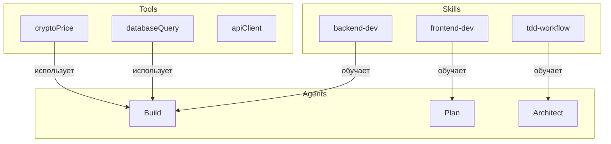
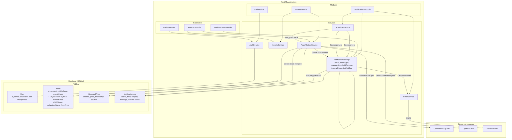

# AGENTS.md — Глобальный регламент разработки

Этот файл определяет архитектуру, бизнес-логику и общие правила проекта. Перед началом работы над конкретным слоем приложения, обязательно изучите соответствующее руководство:

## Все настройки агента только в папке ./.opencode

## Все новые настройки для агента необходимо размещать только в ./.opencode

- **Backend (NestJS)**: См. `./opencode/BACKEND.md`
- **Frontend (React)**: См. `./opencode/FRONTEND.md`

## 🎯 Обзор приложения

Система мониторинга криптовалютных активов и NFT с автоматическими обновлениями, уведомлениями и отчетами.

### Ключевой функционал:

- **Мониторинг**: Автоматическое обновление цен (CoinMarketCap для крипто, OpenSea для NFT) каждые 4 часа.
- **Персонализация**: Настройка интервалов обновления (2–12 часов) и порогов срабатывания алертов.
- **Уведомления**: Email-информирование при достижении заданного % изменения цены.
- **Аналитика**: Генерация отчетов (день, неделя, месяц, квартал, год) и хранение истории цен.
- **Безопасность**: JWT-аутентификация (роли: `user`, `admin`).

---

## 💼 Бизнес-логика

### 1. Управление активами

Для каждого актива (криптовалюта или NFT) в портфеле пользователя система:

1. Опрашивает внешние API.
2. Рассчитывает % изменения к текущей цене.
3. Логирует исторические данные для графиков.

### 2. Логика уведомлений

Алерты срабатывают на базе фильтров пользователя:

- **Порог изменения**: Например, уведомлять только при скачке > 5%.
- **Интервал**: Ограничение частоты писем (раз в 2-12 часов), чтобы избежать спама.

### 3. Алгоритм отчетов

Отчеты (Daily, Weekly, Monthly, Quarterly, Yearly) рассчитываются как дельта между ценой на начало периода и текущей рыночной ценой. По завершении периода поля обновляются новыми значениями.

---

## 🛠 Общие технические принципы

1.  **Язык**: TypeScript 5+ (строгая типизация `strict: true`).
2.  **Стиль кода**: 2 пробела, одинарные кавычки, точки с запятой обязательны.
3.  **Документирование**: Обязательный JSDoc для публичных методов и классов.
4.  **Коммиты**: Информативные сообщения на английском или русском языке (согласно правилам репозитория).

---

## 📋 Процесс работы с задачами

Каждая задача начинается с создания файлов декомпозиции в `.opencode/features/`. Это обязательный первый шаг для любой фичи, бага или рефакторинга.

### Структура хранения задач

```
.opencode/features/
├── backend/
│   ├── feat_1/
│   │   ├── feature_1.md          # План и декомпозиция
│   │   ├── sub_task_1.md         # Атомарная задача 1
│   │   ├── sub_task_2.md         # Атомарная задача 2
│   │   └── STATUS.md             # Статус задачи
│   ├── feat_2/
│   └── feat_N/
└── frontend/
    ├── feat_1/
    └── feat_N/
```

**Нумерация:** Независимая для backend и frontend (feat_1, feat_2... без ведущих нулей). Максимум 5 sub-tasks на задачу.

### Алгоритм создания задачи

**Шаг 1: Определение номера задачи**
Найти максимальный существующий номер в `./opencode/features/{backend|frontend}/` и создать папку `feat_{N+1}`.

**Шаг 2: Сбор контекста (ОБЯЗАТЕЛЬНО)**
Перед декомпозицией использовать tool `contextDocs` для получения архитектурных гайдлайнов:
```typescript
[context_docs: {"layer": "backend", "topic": "ARCHITECTURE"}]
[context_docs: {"layer": "backend", "search": "relevant_keyword"}]
```

**Шаг 3: Создание feature_{N}.md**
Создать главный файл с:
- Описание задачи
- Контекст (полученный из contextDocs)
- Декомпозиция на 3-5 атомарных операций
- Оценка сложности
- Зависимости

**Шаг 4: Создание sub_task_{1-5}.md**
Для каждой атомарной операции создать отдельный файл с:
- Подробное описание задачи
- Способ решения (с использованием contextDocs)
- Ожидаемый результат
- Критерии приёмки

**Шаг 5: Создание STATUS.md**
Создать файл статуса со статусом "to do".

**Шаг 6: Обновление статуса**
При начале работы обновить STATUS.md на "in progress" и начать с sub_task_1.md.

**Шаг 7: Завершение**
После выполнения всех sub-tasks обновить STATUS.md на "done".

### Формат STATUS.md

```markdown
# Status: feat_{N}

- **Current:** to do | in progress | done | closed
- **Started:** YYYY-MM-DD HH:MM
- **Completed:** YYYY-MM-DD HH:MM (если применимо)
- **Current Sub-task:** sub_task_1.md

## Прогресс
- [ ] sub_task_1.md
- [ ] sub_task_2.md
- [ ] sub_task_3.md
```

### Правила работы с задачами

1. **Независимость:** Backend и frontend имеют независимую нумерацию
2. **Неизменность:** Sub-tasks не меняются в процессе работы. Если нужны изменения — создаётся новая задача
3. **Максимум:** Не более 5 sub-tasks на одну задачу
4. **Обязательность:** Каждая задача должна начинаться с создания структуры в `.opencode/features/`
5. **Контекст:** Обязательно использовать `contextDocs` для получения архитектурной информации
6. **Статус:** STATUS.md обновляется при каждом изменении состояния

---

## 🧩 Концепция разработки: TDD (Test-Driven Development)

В данном проекте мы придерживаемся парадигмы TDD, популяризированной Кентом Беком. Основная идея заключается в инверсии процесса: мы определяем желаемое поведение системы в виде теста до того, как пишем саму реализацию. Это гарантирует 100% покрытие функционала тестами и предотвращает написание избыточного кода («You Ain't Gonna Need It» — YAGNI).

### 🚀 Алгоритм решения любой задачи

Любая задача (фича, баг, рефакторинг) должна проходить через следующий цикл:

#### 1. Подготовка

**Требования и контекст:**
Сначала полностью проанализируй запрос. Убедись, что понятны:

- входные данные,
- ожидаемый результат,
- ограничения (лимиты API, роли пользователей и т.д.).

**Скелет решения:**
Опиши словами или псевдокодом архитектурный план:

- Какие файлы будут затронуты?
- Нужны ли новые DTO, Entity или Redux-слайсы?

#### 2. Реализация (Цикл Red → Green → Refactor)

**Шаг A: TDD Testing (RED)**

Напиши модульный тест (unit test), описывающий новую функциональность.

Запусти тест:

```bash
npm test -- имя-файла.spec.ts
```

Он должен упасть (ошибка компиляции или провал assertion).
Это подтверждает, что тест действительно проверяет отсутствие фичи и не даёт ложноположительных результатов.

**Шаг B: Пишем код (GREEN)**

Напиши минимально возможный объём кода, чтобы тест прошёл.

Не старайся сразу сделать «красиво» или «универсально». Твоя цель на этом этапе — зелёный статус тестов.

**Шаг C: Тестируем код**

Запусти все тесты в модуле:

```bash
npm test
```

Убедись, что новая реализация не сломала существующий функционал (регрессия).

**Шаг D: Рефакторинг (REFACTOR)**

Оптимизируй код:

- убери дублирование,
- улучши именование,
- вынеси логику в отдельные методы при необходимости.

**Важно:** Рефакторинг проводится только при наличии зелёных тестов.

**Лимит:** Не более 3 итераций рефакторинга, чтобы избежать over-engineering. После каждой итерации тесты должны оставаться зелёными.

---

# OpenCode Environment

## Структура

```
.opencode/
├── opencode.json          # Конфигурация агентов и прав
├── AGENTS.md             # Документация агентов
├── tools/                # Кастомные инструменты
│   ├── cryptoPrice.ts    # Пример: получение цен крипто
│   └── ...
├── skills/               # Agent Skills
│   ├── backend-dev/      # Backend разработка
│   │   └── SKILL.md
│   ├── frontend-dev/     # Frontend разработка
│   │   └── SKILL.md
│   └── tdd-workflow/     # TDD подход
│       └── SKILL.md
├── agents/               # Кастомные агенты
│   └── (agent configs)
└── plugins/              # Плагины
    └── (plugin files)
```

## Агенты

### Встроенные

- **Build** — режим разработки, полный доступ
- **Plan** — режим анализа, только чтение

### Кастомные

- **Architect** — анализ архитектуры, только чтение
- **Reviewer** — code review, поиск багов

## Связь Tools ↔ Skills ↔ Agents



**Как это работает:**

1. **Tools** предоставляют функциональность (читать файлы, вызывать API)
2. **Skills** обучают агентов специфике проекта
3. **Agents** комбинируют tools и знания из skills для решения задач

## Добавление новых компонентов

### Добавить Tool

1. Создать файл `.opencode/tools/myTool.ts`
2. Описать tool с помощью `@opencode-ai/plugin`
3. OpenCode автоматически обнаружит при запуске

### Добавить Skill

1. Создать папку `.opencode/skills/my-skill/`
2. Создать файл `SKILL.md` с инструкциями
3. Агент сможет загрузить skill по требованию

### Добавить Agent

1. Добавить конфигурацию в `.opencode/opencode.json` в секцию `agent`
2. Указать режим (plan/build) и права
3. Написать system prompt

## Конфигурация

Основные настройки в `opencode.json`:

- `model` — используемая LLM модель
- `permission` — права доступа к tools
- `agent` — конфигурации агентов
- `mcp` — подключение MCP серверов
- `rules` — правила для всех агентов

## Быстрый старт

1. **Анализ кода:**
   ```
   /mode plan
   Проанализируй архитектуру backend
   ```

2. **Разработка:**
   ```
   /mode build
   Реализуй новый endpoint для получения цен активов
   ```

3. **Code Review:**
   ```
   /agent reviewer
   Проверь этот PR на баги
   ```

4. **Использование Skills:**
   ```
   Загрузи skill tdd-workflow
   Напиши тесты для этой функции
   ```

## Расширение

Создавайте tools для интеграции с вашими API, skills для документирования подходов к разработке, агентов для специализированных задач.

Все компоненты автоматически связываются через Tool Registry и доступны агентам.

## Диаграмма сервиса бэкенда


