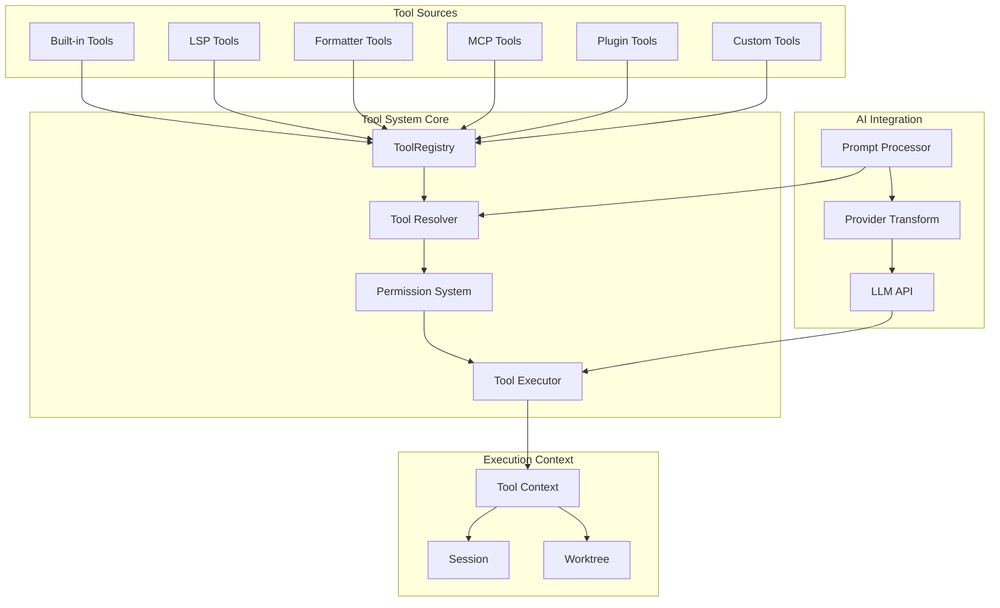
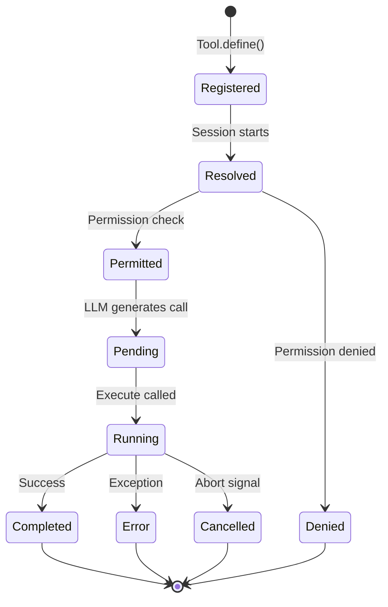
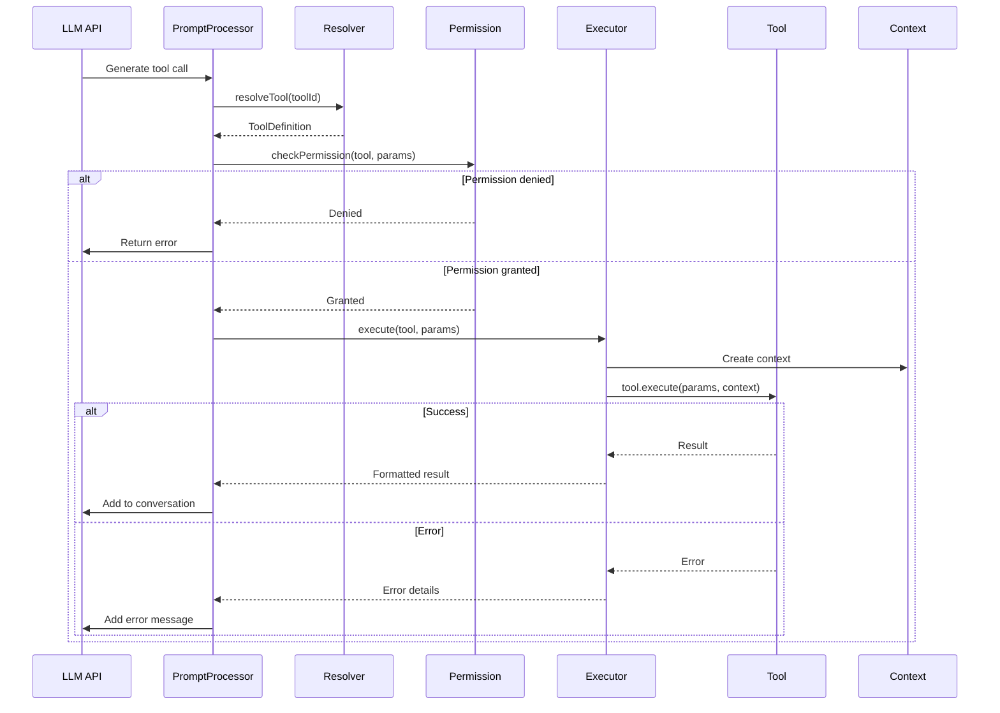
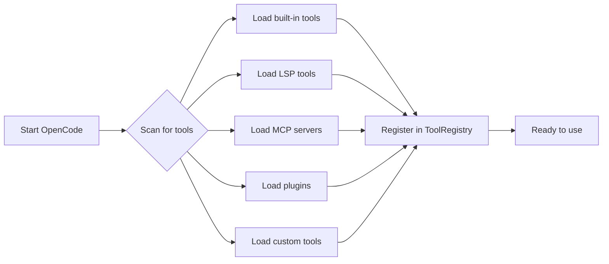
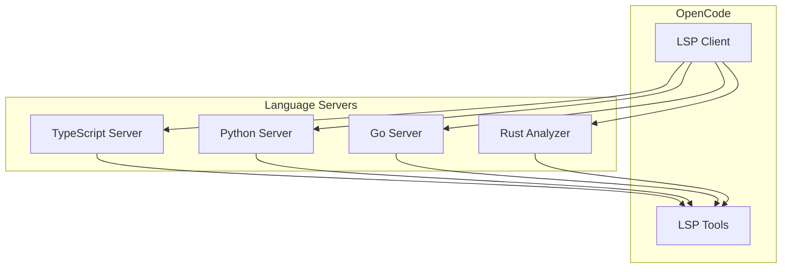
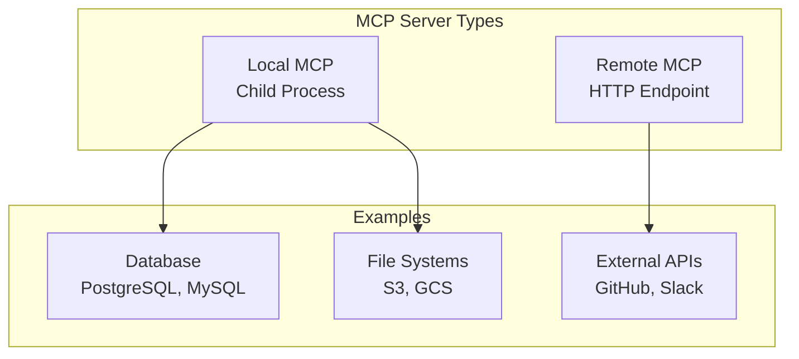

# OpenCode Tool System — Полное руководство

## Содержание

1. [Архитектура Tool System](#архитектура-tool-system)
2. [Встроенные инструменты (Built-in Tools)](#встроенные-инструменты-built-in-tools)
3. [Работа с файловой системой](#работа-с-файловой-системой)
4. [Внешние инструменты и их обнаружение](#внешние-инструменты-и-их-обнаружение)
5. [LSP интеграция](#lsp-интеграция)
6. [MCP (Model Context Protocol)](#mcp-model-context-protocol)
7. [Создание кастомных инструментов](#создание-кастомных-инструментов)
8. [Пример: Crypto Price Tool](#пример-crypto-price-tool)

---

## Архитектура Tool System

### Общая архитектура

Tool System в OpenCode построен на многоуровневой архитектуре с чётким разделением ответственности:



### Жизненный цикл инструмента



### Компоненты системы

#### 1. ToolRegistry

Централизованное хранилище всех доступных инструментов:

```typescript
// packages/opencode/src/tool/registry.ts
class ToolRegistry {
  private tools = new Map<string, ToolDefinition>();
  
  // Регистрация инструмента
  register(tool: ToolDefinition): void {
    this.tools.set(tool.id, tool);
  }
  
  // Получение инструмента по ID
  get(id: string): ToolDefinition | undefined {
    return this.tools.get(id);
  }
  
  // Получение всех инструментов
  getAll(): ToolDefinition[] {
    return Array.from(this.tools.values());
  }
  
  // Удаление инструмента
  unregister(id: string): void {
    this.tools.delete(id);
  }
}
```

#### 2. Tool Definition

Структура определения инструмента:

```typescript
interface ToolDefinition<TParams = any, TResult = any> {
  // Уникальный идентификатор
  id: string;
  
  // Описание для AI модели
  description: string;
  
  // Zod схема параметров
  parameters: z.ZodObject<any>;
  
  // Функция выполнения
  execute: (
    params: TParams,
    context: ToolContext
  ) => Promise<TResult>;
}
```

#### 3. Tool Context

Контекст выполнения передаётся в каждый инструмент:

```typescript
interface ToolContext {
  // Идентификаторы
  sessionID: string;
  messageID: string;
  agent: string;
  
  // Пути
  directory: string;      // Текущая рабочая директория
  worktree: string;       // Корень git worktree
  
  // Функции
  ask: (permission: PermissionRequest) => Promise<boolean>;
  metadata: (data: Record<string, any>) => void;
  abort: AbortSignal;
}
```

### Pipeline выполнения



---

## Встроенные инструменты (Built-in Tools)

### Список встроенных инструментов

| Tool ID | Назначение | Права доступа | Реализация |
|---------|------------|---------------|------------|
| **read** | Чтение файлов | `read` | `src/tool/read.ts` |
| **write** | Запись файлов | `edit` | `src/tool/write.ts` |
| **edit** | Редактирование файлов | `edit` | `src/tool/edit.ts` |
| **bash** | Shell команды | `bash` | `src/tool/bash.ts` |
| **glob** | Поиск файлов | `read` | `src/tool/glob.ts` |
| **grep** | Поиск в содержимом | `read` | `src/tool/grep.ts` |
| **list** | Список директории | `read` | `src/tool/ls.ts` |
| **task** | Subagent delegation | `task` | `src/tool/task.ts` |

### 1. Read Tool

Чтение содержимого файлов с поддержкой частичного чтения.

**Параметры:**
```typescript
{
  filePath: string;        // Путь к файлу (обязательный)
  offset?: number;         // Начальная строка (опционально)
  limit?: number;          // Количество строк (опционально)
}
```

**Пример использования:**
```typescript
// Чтение всего файла
const result = await readTool.execute({
  filePath: "src/main.ts"
});

// Чтение с 10-й строки, 50 строк
const result = await readTool.execute({
  filePath: "src/main.ts",
  offset: 10,
  limit: 50
});
```

**Реализация:**
```typescript
// src/tool/read.ts
export const readTool = Tool.define({
  id: "read",
  description: "Read file contents from the filesystem",
  parameters: z.object({
    filePath: z.string().describe("Path to the file"),
    offset: z.number().optional().describe("Line offset to start reading"),
    limit: z.number().optional().describe("Number of lines to read"),
  }),
  
  execute: async (params, context) => {
    const fullPath = path.join(context.worktree, params.filePath);
    
    // Проверка безопасности
    if (!isWithinWorktree(fullPath, context.worktree)) {
      throw new Error("Access denied: path outside worktree");
    }
    
    const content = await fs.readFile(fullPath, "utf-8");
    const lines = content.split("\n");
    
    // Применяем offset и limit
    const start = params.offset || 0;
    const end = params.limit 
      ? start + params.limit 
      : lines.length;
    
    return {
      content: lines.slice(start, end).join("\n"),
      totalLines: lines.length,
      startLine: start,
      endLine: end
    };
  }
});
```

### 2. Write Tool

Создание новых файлов или перезапись существующих.

**Параметры:**
```typescript
{
  filePath: string;        // Путь к файлу
  content: string;         // Содержимое файла
}
```

**Пример:**
```typescript
await writeTool.execute({
  filePath: "src/new-file.ts",
  content: "export const hello = 'world';"
});
```

### 3. Edit Tool

Точечное редактирование файлов через поиск и замену строк.

**Параметры:**
```typescript
{
  filePath: string;        // Путь к файлу
  oldString: string;       // Текст для поиска
  newString: string;       // Текст для замены
}
```

**Пример:**
```typescript
await editTool.execute({
  filePath: "src/config.ts",
  oldString: "const API_URL = 'http://localhost:3000';",
  newString: "const API_URL = 'https://api.production.com';"
});
```

**Особенности:**
- Требует точного совпадения строки
- Может редактировать несколько вхождений
- Сохраняет форматирование файла
- Генерирует ошибку, если строка не найдена

### 4. Bash Tool

Выполнение shell команд в окружении проекта.

**Параметры:**
```typescript
{
  command: string;         // Команда для выполнения
  workdir?: string;        // Рабочая директория (опционально)
  timeout?: number;        // Таймаут в мс (опционально)
}
```

**Пример:**
```typescript
await bashTool.execute({
  command: "npm install",
  workdir: "backend",
  timeout: 120000  // 2 минуты
});
```

**Безопасность:**
- Команды выполняются в sandbox
- Проверка dangerous patterns (rm -rf /)
- Логирование всех команд
- Ограничение по timeout

### 5. Glob Tool

Поиск файлов по glob patterns.

**Параметры:**
```typescript
{
  pattern: string;         // Glob pattern (например, "**/*.ts")
  path?: string;           // Базовый путь (опционально)
}
```

**Пример:**
```typescript
const files = await globTool.execute({
  pattern: "**/*.spec.ts",
  path: "src"
});
// Returns: ["src/app.spec.ts", "src/utils.spec.ts", ...]
```

### 6. Grep Tool

Поиск в содержимом файлов с использованием regex.

**Параметры:**
```typescript
{
  pattern: string;         // Regex pattern
  path?: string;           // Путь для поиска
  include?: string;        // Фильтр файлов (glob)
}
```

**Пример:**
```typescript
const matches = await grepTool.execute({
  pattern: "function\s+\w+",
  path: "src",
  include: "*.ts"
});
```

### 7. List Tool

Список содержимого директории.

**Параметры:**
```typescript
{
  path: string;            // Путь к директории
}
```

**Возвращает:**
```typescript
{
  files: Array<{
    name: string;
    type: "file" | "directory";
    size?: number;
    modified?: Date;
  }>;
}
```

### 8. Task Tool

Делегирование задач subagent.

**Параметры:**
```typescript
{
  description: string;     // Краткое описание задачи
  prompt: string;          // Детальные инструкции
}
```

**Пример:**
```typescript
const result = await taskTool.execute({
  description: "Find API endpoints",
  prompt: "Search for all Express.js route definitions in the codebase and list them with their HTTP methods and paths."
});
```

---

## Работа с файловой системой

### Принципы безопасности

1. **Worktree Sandboxing** — все операции ограничены git worktree
2. **Path Validation** — проверка, что путь внутри worktree
3. **Symlink Resolution** — разрешение символических ссылок
4. **Ignore Patterns** — уважение .gitignore

### Path Resolution

```typescript
function resolvePath(inputPath: string, context: ToolContext): string {
  // 1. Нормализация пути
  const normalized = path.normalize(inputPath);
  
  // 2. Разрешение относительно worktree
  const absolute = path.resolve(context.worktree, normalized);
  
  // 3. Проверка границ
  if (!absolute.startsWith(context.worktree)) {
    throw new Error("Path outside worktree");
  }
  
  // 4. Разрешение symlinks
  const realPath = fs.realpathSync(absolute);
  
  if (!realPath.startsWith(context.worktree)) {
    throw new Error("Symlink points outside worktree");
  }
  
  return realPath;
}
```

### File Watching

OpenCode отслеживает изменения файлов через file system watchers:

```typescript
// Автоматическая перезагрузка при изменении конфигурации
const watcher = fs.watch(configPath, (eventType, filename) => {
  if (filename === 'opencode.json') {
    reloadConfig();
  }
});
```

---

## Внешние инструменты и их обнаружение

### Методы подключения внешних инструментов

1. **MCP Servers** (Model Context Protocol)
2. **Plugins** (JavaScript/TypeScript)
3. **Custom Tools** (Project-level)

### Discovery механизм



### Конфигурация внешних инструментов

```json
// opencode.json
{
  "mcp": {
    "github": {
      "type": "remote",
      "url": "https://api.github.com/mcp",
      "enabled": true
    },
    "postgres": {
      "type": "local",
      "command": ["npx", "-y", "@modelcontextprotocol/server-postgres"],
      "environment": {
        "DATABASE_URL": "postgresql://..."
      }
    }
  },
  
  "plugin": [
    "@my-org/opencode-plugin"
  ]
}
```

---

## LSP интеграция

### Архитектура LSP Tools



### Поддерживаемые LSP операции

| Tool | Описание | LSP Method |
|------|----------|------------|
| `lsp_diagnostics` | Получение ошибок | `textDocument/diagnostic` |
| `lsp_definitions` | Переход к определению | `textDocument/definition` |
| `lsp_references` | Поиск ссылок | `textDocument/references` |
| `lsp_hover` | Информация при наведении | `textDocument/hover` |
| `lsp_symbols` | Символы документа | `textDocument/documentSymbol` |
| `lsp_workspaceSymbol` | Символы workspace | `workspace/symbol` |

### Конфигурация LSP

```json
// opencode.json
{
  "lsp": {
    "typescript": {
      "enabled": true,
      "command": ["typescript-language-server", "--stdio"]
    },
    "python": {
      "enabled": true,
      "command": ["pylsp"]
    }
  }
}
```

### Пример использования LSP Tools

```typescript
// Поиск определения функции
const definition = await lspTools.definitions.execute({
  filePath: "src/app.ts",
  position: { line: 10, character: 15 }
});

// Получение ошибок компиляции
const diagnostics = await lspTools.diagnostics.execute({
  filePath: "src/app.ts"
});
```

---

## MCP (Model Context Protocol)

### Что такое MCP?

Model Context Protocol — стандартизированный протокол для интеграции внешних ресурсов и инструментов с AI агентами.

### Типы MCP серверов



### Конфигурация MCP

#### Local MCP Server

```json
{
  "mcp": {
    "sqlite": {
      "type": "local",
      "command": ["uvx", "mcp-server-sqlite", "--db-path", "data.db"],
      "enabled": true,
      "timeout": 10000
    }
  }
}
```

#### Remote MCP Server

```json
{
  "mcp": {
    "github": {
      "type": "remote",
      "url": "https://api.github.com/mcp",
      "headers": {
        "Authorization": "Bearer ${GITHUB_TOKEN}"
      },
      "oauth": {
        "clientId": "your-client-id",
        "scope": "repo"
      }
    }
  }
}
```

### MCP Tool Namespace

MCP инструменты именуются по схеме: `serverName/toolName`

```
# Примеры
sqlite/query
postgres/execute
github/getRepository
slack/sendMessage
```

### OAuth Authentication

```typescript
// Автоматическое получение токена через RFC 7591
interface OAuthConfig {
  clientId?: string;       // Опционально (динамическая регистрация)
  clientSecret?: string;   // Для confidential clients
  scope: string;          // Запрашиваемые scopes
}

// Поток авторизации
1. Проверка OAuth support в MCP server
2. Dynamic client registration (если нужно)
3. Authorization redirect
4. Token exchange
5. Сохранение токена
```

---

## Создание кастомных инструментов

### Базовая структура

Custom tools создаются в:
- `.opencode/tools/` — project-level
- `~/.config/opencode/tools/` — global

### API Custom Tools

```typescript
import { tool } from "@opencode-ai/plugin";
import { z } from "zod";

// Определение инструмента
export default tool({
  id: "my_tool",           // ID инструмента
  description: "Does something useful",
  
  // Параметры (Zod схема)
  args: {
    input: z.string().describe("Input data"),
    count: z.number().optional().describe("Optional count"),
  },
  
  // Функция выполнения
  async execute(args, context) {
    // args.input, args.count
    // context.agent, context.sessionID, context.directory
    
    return `Processed: ${args.input}`;
  },
});
```

### Несколько инструментов в одном файле

```typescript
// .opencode/tools/math.ts
import { tool } from "@opencode-ai/plugin";

export const add = tool({
  description: "Add two numbers",
  args: {
    a: tool.schema.number(),
    b: tool.schema.number(),
  },
  execute: async (args) => args.a + args.b,
});

export const multiply = tool({
  description: "Multiply two numbers",
  args: {
    a: tool.schema.number(),
    b: tool.schema.number(),
  },
  execute: async (args) => args.a * args.b,
});

// Создаёт инструменты: math_add, math_multiply
```

### Context API

```typescript
async execute(args, context) {
  // Информация о сессии
  console.log(context.agent);        // "build" | "plan"
  console.log(context.sessionID);    // UUID сессии
  console.log(context.directory);    // Текущая директория
  console.log(context.worktree);     // Корень проекта
  
  // Запрос разрешения
  const allowed = await context.ask({
    tool: "my_tool",
    action: "execute",
    params: args,
  });
  
  if (!allowed) {
    throw new Error("Permission denied");
  }
  
  // Метаданные
  context.metadata({
    executionTime: Date.now() - startTime,
  });
  
  // Проверка отмены
  if (context.abort.aborted) {
    throw new Error("Execution cancelled");
  }
}
```

### Вызов внешних скриптов

```typescript
// Инструмент может вызывать скрипты на любом языке
import { tool } from "@opencode-ai/plugin";
import path from "path";

export default tool({
  description: "Run Python analysis",
  args: {
    script: tool.schema.string(),
    data: tool.schema.string(),
  },
  async execute(args, context) {
    const scriptPath = path.join(context.worktree, ".opencode/tools/analyze.py");
    
    // Используем Bun.$ для выполнения
    const result = await Bun.$`python3 ${scriptPath} ${args.data}`.text();
    
    return result.trim();
  },
});
```

### Permissions для Custom Tools

```json
// opencode.json
{
  "permission": {
    "my_tool": "allow",      // Разрешить без спроса
    "my_tool": "ask",        // Спрашивать каждый раз
    "my_tool": "deny",       // Запретить
    "mcp_*": "ask"          // Все MCP tools спрашивать
  }
}
```

---

## Пример: Crypto Price Tool

Создадим инструмент для получения текущей цены криптовалют (ATOM, MOVE и др.) через CoinGecko API.

### Директория проекта

```
my-project/
├── .opencode/
│   └── tools/
│       └── cryptoPrice.ts    # Наш инструмент
├── src/
└── opencode.json
```

### Реализация

```typescript
// .opencode/tools/cryptoPrice.ts
import { tool } from "@opencode-ai/plugin";
import { z } from "zod";

// Типы ответа от CoinGecko API
interface CoinGeckoResponse {
  [coinId: string]: {
    usd: number;
    usd_market_cap: number;
    usd_24h_vol: number;
    usd_24h_change: number;
    last_updated_at: number;
  };
}

// Карта символов к ID CoinGecko
const COIN_ID_MAP: Record<string, string> = {
  "ATOM": "cosmos",
  "MOVE": "movement",
  "BTC": "bitcoin",
  "ETH": "ethereum",
  "SOL": "solana",
  "AVAX": "avalanche-2",
  "DOT": "polkadot",
  "LINK": "chainlink",
};

export default tool({
  id: "crypto_price",
  description: "Get current cryptocurrency prices from CoinGecko API. " +
    "Supports: ATOM (Cosmos), MOVE (Movement), BTC, ETH, SOL, AVAX, DOT, LINK",
  
  args: {
    symbol: z.string()
      .describe("Cryptocurrency symbol (e.g., 'ATOM', 'MOVE', 'BTC')"),
    
    includeDetails: z.boolean()
      .optional()
      .default(false)
      .describe("Include market cap, volume, and 24h change"),
    
    vsCurrency: z.string()
      .optional()
      .default("usd")
      .describe("Currency to display price in (default: USD)"),
  },
  
  async execute(args, context) {
    const { symbol, includeDetails, vsCurrency } = args;
    
    // Нормализация символа
    const normalizedSymbol = symbol.toUpperCase();
    
    // Получение CoinGecko ID
    const coinId = COIN_ID_MAP[normalizedSymbol];
    if (!coinId) {
      throw new Error(
        `Unknown cryptocurrency: ${symbol}. ` +
        `Supported: ${Object.keys(COIN_ID_MAP).join(", ")}`
      );
    }
    
    // Запрос к CoinGecko API
    try {
      const response = await fetch(
        `https://api.coingecko.com/api/v3/simple/price?` +
        `ids=${coinId}&` +
        `vs_currencies=${vsCurrency}&` +
        `include_market_cap=${includeDetails}&` +
        `include_24hr_vol=${includeDetails}&` +
        `include_24hr_change=${includeDetails}&` +
        `include_last_updated_at=${includeDetails}`
      );
      
      if (!response.ok) {
        throw new Error(`API error: ${response.status} ${response.statusText}`);
      }
      
      const data: CoinGeckoResponse = await response.json();
      const coinData = data[coinId];
      
      if (!coinData) {
        throw new Error(`No data returned for ${symbol}`);
      }
      
      // Форматирование результата
      const price = coinData[vsCurrency.toLowerCase()];
      
      let result = `${normalizedSymbol} Price: $${price.toLocaleString()}`;
      
      if (includeDetails) {
        const currencyUpper = vsCurrency.toUpperCase();
        result += `\n\n` +
          `Market Cap: $${(coinData.usd_market_cap / 1e9).toFixed(2)}B\n` +
          `24h Volume: $${(coinData.usd_24h_vol / 1e6).toFixed(2)}M\n` +
          `24h Change: ${coinData.usd_24h_change >= 0 ? "+" : ""}${coinData.usd_24h_change.toFixed(2)}%\n` +
          `Last Updated: ${new Date(coinData.last_updated_at * 1000).toLocaleString()}`;
      }
      
      // Логирование метаданных
      context.metadata({
        symbol: normalizedSymbol,
        coinId,
        price,
        currency: vsCurrency,
        timestamp: new Date().toISOString(),
      });
      
      return result;
      
    } catch (error) {
      throw new Error(
        `Failed to fetch price for ${symbol}: ${error instanceof Error ? error.message : "Unknown error"}`
      );
    }
  },
});
```

### Использование

```
# В конверсации с OpenCode
User: What's the current price of ATOM?

Agent: I'll check the current ATOM price for you.

[crypto_price: {"symbol": "ATOM"}]

ATOM Price: $4.23

User: Can you get more details about MOVE?

Agent: I'll get detailed information about MOVE.

[crypto_price: {"symbol": "MOVE", "includeDetails": true}]

MOVE Price: $0.85

Market Cap: $1.24B
24h Volume: $45.67M
24h Change: +5.23%
Last Updated: 2/10/2026, 3:45:23 PM
```

### Расширенная версия с кэшированием

```typescript
// .opencode/tools/cryptoPrice.ts
import { tool } from "@opencode-ai/plugin";
import { z } from "zod";

// Простой in-memory кэш
interface CacheEntry {
  data: any;
  timestamp: number;
}

const cache = new Map<string, CacheEntry>();
const CACHE_TTL = 60_000; // 1 минута

function getCached<T>(key: string): T | null {
  const entry = cache.get(key);
  if (entry && Date.now() - entry.timestamp < CACHE_TTL) {
    return entry.data;
  }
  return null;
}

function setCached<T>(key: string, data: T): void {
  cache.set(key, { data, timestamp: Date.now() });
}

export default tool({
  id: "crypto_price",
  description: "Get cryptocurrency prices (cached for 60 seconds)",
  
  args: {
    symbol: z.string().describe("Cryptocurrency symbol"),
    forceRefresh: z.boolean().optional().default(false),
  },
  
  async execute(args, context) {
    const cacheKey = `price:${args.symbol.toUpperCase()}`;
    
    // Проверяем кэш
    if (!args.forceRefresh) {
      const cached = getCached(cacheKey);
      if (cached) {
        context.metadata({ cacheHit: true });
        return cached;
      }
    }
    
    // Запрос к API...
    const result = await fetchPrice(args.symbol);
    
    // Сохраняем в кэш
    setCached(cacheKey, result);
    context.metadata({ cacheHit: false });
    
    return result;
  },
});
```

### Конфигурация permissions

```json
// opencode.json
{
  "$schema": "https://opencode.ai/config.json",
  "permission": {
    "crypto_price": "allow",
    "read": "allow",
    "bash": "ask"
  }
}
```

---

## Лучшие практики

### 1. Безопасность

```typescript
// Всегда проверяйте входные данные
const validated = schema.parse(args);

// Никогда не выполняйте произвольный код
// ❌ Плохо
eval(args.code);

// ✅ Хорошо
executeSpecificOperation(args.param);

// Ограничивайте доступ к файловой системе
if (!isWithinWorktree(filePath, context.worktree)) {
  throw new Error("Access denied");
}
```

### 2. Обработка ошибок

```typescript
async execute(args, context) {
  try {
    const result = await operation();
    return result;
  } catch (error) {
    // Детальное сообщение об ошибке
    throw new Error(
      `Operation failed: ${error.message}\n` +
      `Context: ${JSON.stringify(context.metadata)}`
    );
  }
}
```

### 3. Оптимизация

```typescript
// Используйте кэширование для expensive operations
// Реализуйте timeout для сетевых запросов
// Обрабатыв abort signals для отмены
```

### 4. Документация

```typescript
tool({
  // Чёткое описание для AI
  description: "Clear, concise description of what the tool does. " +
    "Include supported formats, limitations, and examples.",
  
  // Документируйте все параметры
  args: {
    param: z.string()
      .describe("Detailed description of what this parameter does")
  }
});
```

---

## Заключение

Tool System в OpenCode — мощная и гибкая система для расширения возможностей AI агентов:

1. **Built-in tools** — базовые операции с файлами и shell
2. **LSP integration** — code intelligence для 20+ языков
3. **MCP** — стандартизированный протокол для внешних сервисов
4. **Custom tools** — лёгкое создание специализированных инструментов

Ключевые преимущества:
- ✅ Строгая типизация (Zod)
- ✅ Безопасность (sandbox, permissions)
- ✅ Модульность (plugins, MCP)
- ✅ Простота создания custom tools

Для получения дополнительной информации:
- Документация: https://opencode.ai/docs
- GitHub: https://github.com/anomalyco/opencode
- Discord: https://discord.gg/opencode
