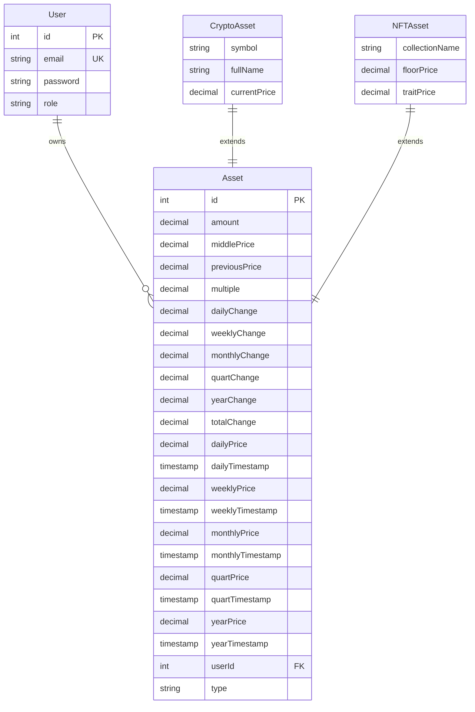
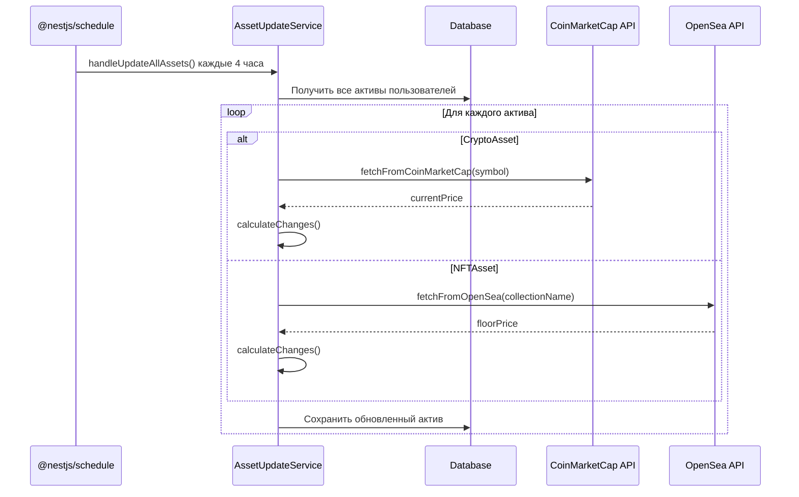

# Архитектура системы мониторинга активов

## Обзор системы

Система предназначена для мониторинга криптовалютных активов и NFT с автоматическими обновлениями каждые 4 часа. Поддерживает множественных пользователей с ролями (user/admin) и интеграцию с внешними API (CoinMarketCap, OpenSea).

## Компоненты системы

### 1. Сущности базы данных



### 2. Архитектура модулей NestJS

```mermaid
graph TB
    A[AppModule] --> B[AuthModule]
    A --> C[AssetsModule]
    A --> D[NotificationsModule]

    B --> B1[AuthService]
    B --> B2[AuthController]
    B --> B3[JwtStrategy]
    B --> B4[User Entity]

    C --> C1[AssetsService]
    C --> C2[AssetsController]
    C --> C3[AssetUpdateService]
    C --> C4[Asset Entity]
    C --> C5[CryptoAsset Entity]
    C --> C6[NFTAsset Entity]

    C3 --> E[ScheduleModule]
    C3 --> F[HttpModule]

    E --> G[@nestjs/schedule]
    F --> H[axios]
```

### 3. Поток обновления активов



### 4. API интеграции

#### CoinMarketCap API

- **Endpoint**: `https://pro-api.coinmarketcap.com/v1/cryptocurrency/quotes/latest`
- **Параметры**: symbol (BTC, ETH, etc.), convert=USD
- **Заголовки**: X-CMC_PRO_API_KEY
- **Ответ**: Текущая цена в USD

#### OpenSea API

- **Endpoint**: `https://api.opensea.io/api/v2/collections/{collectionName}/stats`
- **Заголовки**: X-API-KEY
- **Ответ**: Статистика коллекции, включая floor_price

### 5. Переменные окружения

```env
# API Keys
COINMARKETCAP_API_KEY=your_coinmarketcap_api_key
OPENSEA_API_KEY=your_opensea_api_key

# Database
DB_TYPE=sqlite
DB_DATABASE=database.sqlite

# JWT
JWT_SECRET=your_jwt_secret
```

### 6. Роли пользователей

- **user**: Стандартный пользователь, может управлять своими активами
- **admin**: Администратор, имеет расширенные права (будущие возможности)

### 7. Cron расписание

- **Текущее**: Каждый час (`@Cron(CronExpression.EVERY_HOUR)`)
- **Требуемое**: Каждые 4 часа (`@Cron('0 */4 * * *')`)

### 8. Seeding данных

Создать скрипт для инициализации тестовых данных:

**Пользователи:**

- Admin: email: `admin@example.com`, password: `admin123`, role: `admin`
- User: email: `user@example.com`, password: `user123`, role: `user`

**Активы per пользователь:**

- **Crypto Assets:**
  - BTC (Bitcoin) - amount: 0.5, middlePrice: 45000
  - ETH (Ethereum) - amount: 2.0, middlePrice: 3000
- **NFT Assets:**
  - Bored Ape Yacht Club - amount: 1, middlePrice: 50000, floorPrice: 45000
  - CryptoPunks - amount: 1, middlePrice: 40000, floorPrice: 35000

**Скрипт seeding:** `npm run seed` или отдельный файл `seed.ts`

### 9. Безопасность

- JWT аутентификация
- Хэширование паролей (bcrypt)
- Валидация входных данных (class-validator)
- Защита от SQL инъекций (TypeORM)

### 10. Производительность и надежность

- **Batch обновления активов**: Групповая обработка для снижения нагрузки
- **Лимиты API запросов**: 50-100 запросов per user с паузами между вызовами
- **Rate limiting**: Задержки 1-2 секунды между API запросами для избежания блокировок
- **Обработка ошибок**: Retry логика с exponential backoff для неудачных запросов
- **Логирование**: Детальное логирование всех операций и ошибок
- **Асинхронная обработка**: Promise.all для параллельной обработки независимых запросов
- **Graceful degradation**: Продолжение работы при недоступности одного из API

### 11. Мониторинг и оповещения

- **Логи cron jobs**: Отслеживание успешности запусков обновлений
- **API health checks**: Мониторинг доступности внешних сервисов
- **Error notifications**: Оповещения при множественных неудачах
- **Performance metrics**: Время выполнения обновлений, количество обработанных активов

## План реализации

1. **Модификация сущностей**: Добавить связь Asset-User
2. **Обновление сервисов**: Фильтрация по пользователю
3. **Cron job**: Изменить интервал на 4 часа
4. **Конфигурация**: Создать .env файл
5. **Seeding**: Скрипт для начальных данных
6. **Тестирование**: Интеграционные тесты API и cron
