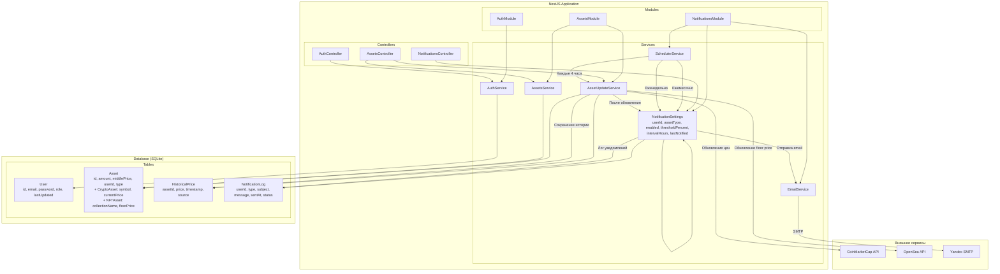

# Документация по системе мониторинга активов (Assets Monitoring System)

## Обзор приложения

Система мониторинга криптовалютных активов и NFT с автоматическими обновлениями, уведомлениями и отчетами. Приложение предназначено для мониторинга портфеля криптовалютных активов и NFT. Оно автоматически обновляет цены активов из внешних API (CoinMarketCap для криптовалют, OpenSea для NFT), рассчитывает изменения цен по различным периодам и отправляет уведомления пользователям о значительных изменениях. Система поддерживает множественных пользователей с персональными настройками уведомлений и интервалами обновлений.

### Основные возможности

- **Мониторинг активов**: Автоматическое обновление цен криптовалют и NFT каждые 4 часа (по умолчанию)
- **Персональные настройки**: Пользовательские интервалы обновлений (2-12 часов) и пороги уведомлений
- **Уведомления**: Email-уведомления о значительных изменениях цен активов
- **Отчеты**: Периодические отчеты о портфеле (ежедневно, еженедельно, ежемесячно, ежеквартально, ежегодно)
- **Исторические данные**: Хранение истории цен для анализа и графиков
- **Безопасность**: JWT-аутентификация с ролями пользователей (user/admin)

## Бизнес-логика

### Управление активами

Пользователи могут добавлять криптовалютные активы (BTC, ETH и др.) и NFT-коллекции в свой портфель. Для каждого актива указывается количество и средняя цена покупки. Система автоматически:

1. Получает актуальные цены из внешних API
2. Рассчитывает процентные изменения по периодам (день, неделя, месяц, квартал, год)
3. Сохраняет исторические данные для аналитики

### Система уведомлений

Уведомления работают на основе пользовательских настроек:

- **Тип актива**: Криптовалюта или NFT
- **Порог изменения**: Процент изменения цены для срабатывания алерта (например, 5%)
- **Интервал уведомлений**: Минимальный интервал между уведомлениями (2-12 часов)
- **Включение/отключение**: Возможность отключить уведомления для определенного типа активов

### Отчеты портфеля

Система генерирует отчеты по всем активам в портфеле:

- **Ежедневные отчеты**: Изменения за день, рассчитанные от предыдущих цен за период к текущей
- **Еженедельные отчеты**: Изменения за неделю, рассчитанные от предыдущих цен за период к текущей
- **Ежемесячные отчеты**: Изменения за месяц, рассчитанные от предыдущих цен за период к текущей
- **Ежеквартальные и ежегодные отчеты**: Аналогично с соответствующими периодами, изменения рассчитываются от предыдущих цен к текущей, поля обновляются на новые значения

## Архитектура и компоненты

Приложение построено на базе NestJS с использованием унифицированной архитектуры модулей и принципов SOLID. Архитектура обеспечивает модульность, слабую связанность компонентов и легкость тестирования.

### Основные модули

- **AssetsModule**: Управление активами, обновление цен, расчет изменений
- **AuthModule**: Аутентификация и авторизация пользователей
- **NotificationsModule**: Уведомления, отчеты, планировщик задач

### База данных

Используется SQLite с следующими сущностями:

- **User**: Пользователи с email, паролем и ролью
- **Asset**: Базовая сущность активов (наследуется CryptoAsset и NFTAsset)
- **HistoricalPrice**: История цен активов
- **NotificationSettings**: Настройки уведомлений пользователей
- **NotificationLog**: Лог отправленных уведомлений

### Внешние интеграции

- **CoinMarketCap API**: Получение цен криптовалют
- **OpenSea API**: Получение floor price NFT-коллекций
- **Yandex SMTP**: Отправка email-уведомлений

### Архитектурные принципы

- **Модульность**: Разделение на независимые модули
- **Dependency Injection**: Внедрение зависимостей через NestJS DI контейнер
- **SOLID принципы**: Разделение ответственности, открытость для расширения
- **Асинхронная обработка**: Promise-based операции для API вызовов
- **Логирование**: Детальное логирование всех операций и ошибок

## Диаграмма работы приложения



## Алгоритм работы системы уведомлений

### 1. Планировщик задач (SchedulerService)

Единый планировщик управляет всеми cron-задачами:

- **Обновление активов**: Каждые 4 часа (или по пользовательским настройкам)
- **Проверка алертов**: Сразу после обновления активов
- **Генерация отчетов**: По расписанию (ежедневно, еженедельно, ежемесячно, ежеквартально, ежегодно)

### 2. Обновление активов (AssetUpdateService)

Алгоритм обновления:

1. Получить пользователей с включенными уведомлениями
2. Для каждого пользователя проверить интервал обновления
3. Если время пришло - обновить активы пользователя:
   - Для криптовалют: запрос к CoinMarketCap API
   - Для NFT: запрос к OpenSea API
4. Рассчитать изменения цен по периодам
5. Сохранить исторические данные
6. Вернуть ID обновленных активов

### 3. Проверка алертов (NotificationService)

После обновления активов:

1. Получить настройки уведомлений для пользователей
2. Для каждого пользователя проверить интервал с последнего уведомления
3. Если интервал прошел - проверить активы на изменения:
   - Сравнить текущее изменение с порогом из настроек
   - Если превышен - добавить в список алертов
4. Если есть алерты - отправить email и обновить время последнего уведомления

### 4. Генерация отчетов

Для каждого периода:

1. Получить все активы пользователей
2. Рассчитать изменения цен от предыдущих значений за период к текущим
3. Обновить поля активов на новые значения
4. Сформировать данные отчета (имя, тип, цена, изменение, общая стоимость)
5. Отправить email с отчетом
6. Залогировать отправку

### 5. Отправка уведомлений

Унифицированная отправка через EmailService:

1. Построить тему и текст сообщения в зависимости от типа (алерт/отчет)
2. Отправить email через Yandex SMTP
3. Сохранить результат в лог уведомлений

## Описание ключевых методов и сервисов

### SchedulerService

Централизованный сервис для управления всеми cron-задачами системы.

- `handleAssetUpdatesAndNotifications()`: Cron-задача обновления активов и уведомлений (каждые 4 часа). Выполняет последовательность: обновление активов → проверка алертов → генерация ежедневных отчетов
- `handleWeeklyReports()`: Cron-задача еженедельных отчетов (каждый понедельник в 9:00)
- `handleMonthlyReports()`: Cron-задача ежемесячных отчетов (1 числа каждого месяца в 9:00)
- `handleQuarterlyReports()`: Cron-задача ежеквартальных отчетов (1 числа каждого квартала в 9:00)
- `handleYearlyReports()`: Cron-задача ежегодных отчетов (1 января в 9:00)
- `triggerAssetUpdatesAndNotifications()`: Ручной запуск обновления активов и уведомлений для тестирования

### AssetUpdateService

Сервис для автоматического обновления цен активов из внешних API.

- `updateAssetsForUsers()`: Обновляет активы по пользовательским настройкам интервалов. Возвращает массив ID обновленных активов для последующей проверки алертов
- `updateCryptoAsset(asset)`: Обновляет цену криптоактива из CoinMarketCap API, рассчитывает изменения и сохраняет исторические данные
- `updateNFTAsset(asset)`: Обновляет floor price NFT из OpenSea API, рассчитывает изменения и сохраняет исторические данные
- `calculateChanges(asset)`: Рассчитывает процентные изменения по периодам (день, неделя, месяц, квартал, год) относительно сохраненных базовых цен
- `saveHistoricalPrice(assetId, price, source)`: Сохраняет историческую цену актива с указанием источника (CoinMarketCap/OpenSea)
- `fetchFromCoinMarketCap(symbol)`: Получает текущую цену криптовалюты из CoinMarketCap API
- `fetchFromOpenSea(collectionName)`: Получает floor price NFT-коллекции из OpenSea API

### NotificationService

Унифицированный сервис для всех типов уведомлений (алерты, отчеты, отправка email).

- `checkAlertsAfterUpdate(userId?, assetIds?)`: Проверяет алерты после обновлений активов. Фильтрует по пользователю и/или активам, проверяет пороги и интервалы уведомлений
- `generatePeriodicReports(period)`: Генерирует отчеты по периоду для всех пользователей с активами
- `sendNotification(type, user, data)`: Унифицированная отправка уведомлений (алерты или отчеты) через email
- `calculatePriceChange(asset)`: Вычисляет изменение цены актива относительно предыдущей цены
- `getPeriodThreshold(period)`: Возвращает порог изменения для периода отчета (5% для дня, 10% для недели, 20% для месяца)
- `getChangeForPeriod(asset, period)`: Получает изменение цены актива для указанного периода
- `buildReportData(assets)`: Формирует данные отчета с информацией об активах, ценах и изменениях
- `buildAlertMessage(alerts)`: Строит текст email-сообщения для алертов
- `buildReportMessage(reportData, period)`: Строит текст email-сообщения для отчетов

### AssetsService

Бизнес-логика управления активами пользователей.

- `findAll()`: Получить все активы (с фильтрацией по пользователю)
- `findOne(id)`: Найти актив по ID
- `create(createAssetDto)`: Создать новый актив
- `update(id, updateAssetDto)`: Обновить актив
- `remove(id)`: Удалить актив

### AuthService

Сервис аутентификации и авторизации.

- `validateUser(email, password)`: Валидация пользователя по email и паролю
- `login(user)`: Генерация JWT токена для пользователя
- `register(createUserDto)`: Регистрация нового пользователя с хэшированием пароля

### EmailService

Сервис отправки email через Yandex SMTP.

- `sendEmail(to, subject, message)`: Отправка email с указанными параметрами

## Установка и запуск

### Требования

- Node.js 18+
- npm или yarn
- SQLite (включается автоматически)

### Установка зависимостей

```bash
cd backend
npm install
```

### Настройка переменных окружения

Создайте файл `.env` в директории `backend/`:

```env
# API Keys
COINMARKETCAP_API_KEY=your_coinmarketcap_api_key
OPENSEA_API_KEY=your_opensea_api_key

# Database
DB_TYPE=sqlite
DB_DATABASE=database.sqlite

# JWT
JWT_SECRET=your_jwt_secret

# Email (Yandex SMTP)
EMAIL_HOST=smtp.yandex.ru
EMAIL_PORT=587
EMAIL_USER=your_email@yandex.ru
EMAIL_PASS=your_app_password
```

### Запуск в режиме разработки

```bash
npm run start:dev
```

Сервер запустится на `http://localhost:3000`

### Сборка и запуск в продакшене

```bash
npm run build
npm run start:prod
```

### Инициализация тестовых данных

```bash
npm run seed
```

Создает тестовых пользователей и активы для демонстрации.

### Доступные скрипты

- `npm run start:dev` - Запуск в режиме разработки с hot-reload
- `npm run start:prod` - Запуск собранного приложения
- `npm run build` - Сборка TypeScript в JavaScript
- `npm run test` - Запуск unit-тестов
- `npm run lint` - Проверка и исправление кода ESLint
- `npm run format` - Форматирование кода Prettier
- `npm run seed` - Инициализация тестовых данных

### API документация

После запуска сервера документация доступна по адресу: `http://localhost:3000/api`

Основные эндпоинты:

- `POST /auth/login` - Аутентификация
- `POST /auth/register` - Регистрация
- `GET /assets` - Получить активы пользователя
- `POST /assets` - Создать актив
- `GET /notifications/settings` - Получить настройки уведомлений
- `POST /notifications/settings` - Обновить настройки уведомлений

## Общие принципы NestJS

### Что такое NestJS?

NestJS - это прогрессивный фреймворк для Node.js, построенный на принципах объектно-ориентированного программирования, функционального программирования и функционального реактивного программирования. Он использует TypeScript как основной язык разработки и вдохновлен Angular.

### Модульная архитектура

NestJS построен на модульной архитектуре, где приложение разбивается на независимые модули. Каждый модуль инкапсулирует связанную функциональность:

- **Модули** (`@Module`) - контейнеры для организации кода, группируют контроллеры, сервисы и другие компоненты
- **Контроллеры** (`@Controller`) - обрабатывают HTTP запросы и возвращают ответы
- **Сервисы** (`@Injectable`) - содержат бизнес-логику приложения
- **Провайдеры** - компоненты, которые могут быть инжектированы (сервисы, репозитории, фабрики и т.д.)

### Dependency Injection (Внедрение зависимостей)

NestJS использует мощную систему dependency injection:

- Компоненты не создают свои зависимости самостоятельно
- Зависимости предоставляются контейнером через конструктор
- Это обеспечивает слабую связанность и легкость тестирования
- Декоратор `@Injectable()` регистрирует класс как провайдер

### Декораторы

NestJS heavily использует декораторы для метаданных:

- `@Module()` - определяет модуль и его компоненты
- `@Controller()` - регистрирует класс как контроллер с путем
- `@Get()`, `@Post()`, `@Put()`, `@Delete()` - определяют HTTP маршруты
- `@Injectable()` - делает класс доступным для dependency injection
- `@Entity()` - отмечает класс как сущность базы данных
- `@Column()` - определяет столбцы в таблице

### Жизненный цикл приложения

1. **Bootstrap** - запуск приложения в `main.ts`
2. **Инициализация модулей** - NestJS создает экземпляры модулей
3. **Dependency injection** - разрешение и инжекция зависимостей
4. **Регистрация маршрутов** - настройка HTTP маршрутов из контроллеров
5. **Запуск сервера** - приложение начинает прослушивать запросы

### Создание компонентов

#### Модуль

```typescript
@Module({
  imports: [], // Другие модули
  controllers: [], // Контроллеры
  providers: [], // Сервисы и провайдеры
  exports: [], // Экспортируемые провайдеры
})
export class MyModule {}
```

#### Контроллер

```typescript
@Controller('path')
export class MyController {
  constructor(private service: MyService) {}

  @Get()
  findAll() {
    return this.service.findAll();
  }
}
```

#### Сервис

```typescript
@Injectable()
export class MyService {
  findAll(): Promise<Item[]> {
    // Бизнес-логика
  }
}
```

## Дальнейшее развитие

Проект может быть расширен:

- Добавление guards для авторизации
- Интеграция с реальными API для получения цен активов
- Реализация отправки email уведомлений
- Добавление ролей и разрешений
- Мониторинг и логирование
- Тестирование (unit и e2e)
